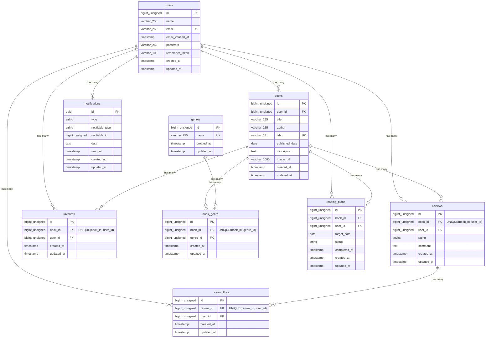

# COACHTECH 書籍レビューアプリ BookShelf

## 概要

書籍レビューアプリケーション「BookShelf」を実装したLaravelプロジェクトです。ユーザーが書籍を登録・閲覧し、レビューやお気に入り登録、レビューへのいいねを利用できます。ジャンルによる分類や平均評価に基づくランキング機能に加え、キーワード・ジャンル・並び順を組み合わせた検索機能、ISBN-13によるGoogle Books API連携、読書統計を確認できるマイ読書レポート、読書計画とリマインダー通知などの機能を実装しています。また、公開APIにはLaravel Sanctumによるトークン認証を導入し、書き込み系エンドポイントへの認証を必須としています。

## 作成者

山崎　達也

## 使用技術

### Backend

- PHP 8.5.5
- Laravel 10.50.2
- Laravel Sanctum 3.3.3
- Laravel Fortify 1.36.2

### Frontend

- Blade
- JavaScript
- Vite 5.4.21
- Tailwind CSS 3.4.19
- Alpine.js 3.15.12

### Database

- MySQL 8.4.9

### Infrastructure

- Docker
- Laravel Sail 1.64.0
- Nginx
- phpMyAdmin

### External API

- Google Books API

### Testing / Code Quality

- PHPUnit
- Laravel Pint

### Version Control

- Git / GitHub

## ER図



## 開発環境URL

http://localhost/books

## 環境構築手順

### 1. リポジトリをクローン

以下のコマンドでBookShelfのリポジトリをクローンします。

```bash
git clone https://github.com/Tatsuya-Yamasaki1024/bookshelf-app.git
```

プロジェクトディレクトリへ移動します。

```bash
cd bookshelf-app
```

### 2. `.env`ファイルの準備

`.env.example`をコピーして`.env`を作成します。

```bash
cp .env.example .env
```

`.env`ファイル内のDB接続情報を以下のように変更します。

```ini
DB_CONNECTION=mysql
DB_HOST=mysql
DB_PORT=3306
DB_DATABASE=laravel
DB_USERNAME=sail
DB_PASSWORD=password
```

`.env.example`では`DB_HOST=127.0.0.1`、`DB_USERNAME=root`、`DB_PASSWORD=`となっていますが、Laravel SailのMySQLコンテナに接続するため、上記の値に変更してください。

重要：`DB_HOST`は`localhost`や`127.0.0.1`ではなく、Dockerコンテナ名である`mysql`を指定します。

### 3. Composer依存パッケージのインストール

初回セットアップ時は`vendor`ディレクトリが存在しないため、以下のコマンドでComposerパッケージをインストールします。

```bash
docker run --rm \
    -u "$(id -u):$(id -g)" \
    -v "$(pwd):/var/www/html" \
    -w /var/www/html \
    laravelsail/php82-composer:latest \
    composer install --ignore-platform-reqs
```

### 4. Laravel Sailの起動

以下のコマンドでDockerコンテナを起動します。

```bash
./vendor/bin/sail up -d
```

毎回`./vendor/bin/sail`と入力するのを省略するため、エイリアスを設定することもできます。

```bash
echo "alias sail='[ -f sail ] && bash sail || bash vendor/bin/sail'" >> ~/.zshrc
```

設定を反映します。

```bash
exec $SHELL
```

エイリアスを設定した場合は、以降`./vendor/bin/sail`の代わりに`sail`でコマンドを実行できます。

### 5. アプリケーションキーの生成

以下のコマンドでアプリケーションキーを生成します。

```bash
./vendor/bin/sail artisan key:generate
```

### 6. データベースのマイグレーションと初期データ投入

以下のコマンドでテーブルを作成し、Seederによる初期データを投入します。

```bash
./vendor/bin/sail artisan migrate --seed
```

既存のデータベースをリセットして最初から構築する場合は、以下を実行します。

```bash
./vendor/bin/sail artisan migrate:fresh --seed
```

※`migrate:fresh`は既存のテーブルを削除するため、開発環境で使用してください。

### 7. フロントエンドのセットアップ

`package.json`に必要なNPMパッケージが定義されているため、以下のコマンドで依存パッケージをインストールします。

```bash
./vendor/bin/sail npm install
```

Viteの開発サーバーを起動します。

```bash
./vendor/bin/sail npm run dev
```

`npm run dev`は開発中、起動したままにしてください。

### 8. Google Books APIの設定

ISBN-13による書籍検索機能ではGoogle Books APIを使用します。

Google Books APIのAPIキーは、このリポジトリには含めていません。

利用・運用する環境の管理者が自身のGoogle CloudプロジェクトでAPIキーを取得し、`.env`に設定してください。

```ini
GOOGLE_BOOKS_API_KEY=取得したAPIキー
```

APIキーを設定した後、以下を実行します。

```bash
./vendor/bin/sail artisan config:clear
```

また、`.env`ファイルはGitにコミットしないでください。

### 9. アプリケーションへのアクセス

ブラウザから以下にアクセスします。

```text
http://localhost/books
```

phpMyAdminを使用する場合は以下にアクセスします。

```text
http://localhost:8080
```

phpMyAdminのログイン情報は`.env`に設定した以下の情報を使用します。

- サーバー：`mysql`
- ユーザー名：`sail`
- パスワード：`password`

### リマインダー通知の実行

読書計画のリマインダー通知と期限切れ処理は、以下のコマンドで実行できます。

```bash
./vendor/bin/sail artisan reading-plans:process-reminders
```

手動で1回だけ実行する場合は、上記のコマンドを実行します。

リマインダー通知は以下のタイミングで送信されます。

- 読書計画の期限3日前
- 読書計画の期限当日
- 読書計画の期限切れ3日後

また、期限を過ぎた読書計画は自動的に「期限切れ」へ変更されます。

継続的に自動実行する場合は、別のターミナルでLaravelのスケジューラーを起動します。

```bash
./vendor/bin/sail artisan schedule:work
```

スケジューラーは起動したままにしてください。

`Ctrl + C`で停止できます。

スケジューラーによって、設定した時刻に`reading-plans:process-reminders`が自動的に実行されます。

## テスト実行

本プロジェクトでは、テスト実行時にSQLiteのインメモリデータベースを使用します。

`phpunit.xml`のテスト環境設定が以下になっていることを確認してください。

```xml
<env name="DB_CONNECTION" value="sqlite"/>
<env name="DB_DATABASE" value=":memory:"/>
```

これにより、テスト実行時はMySQLではなくSQLiteのインメモリデータベースが使用されます。

すべてのテストを実行する場合：

```bash
./vendor/bin/sail artisan test
```

カバレッジ付きで実行する場合：

```bash
./vendor/bin/sail artisan test --coverage
```

## 機能一覧

- ユーザー認証（登録、ログイン、ログアウト）
- 書籍一覧・キーワード検索・ジャンル絞り込み・並び順変更
- 書籍登録・編集・削除
- ISBN-13によるGoogle Books API連携
- 書籍へのレビュー投稿
- レビューへのいいね
- 書籍のお気に入り登録
- ジャンル管理（追加・更新・削除）
- 平均評価に基づくランキング表示
- 公開API（書籍CRUD）
- マイ読書レポート表示
- 読書計画の作成・一覧表示・絞り込み
- 読書計画の編集・削除
- 読書計画の状態変更（読了・期限切れ）
- 読書計画の期限に応じたリマインダー通知
- 読書計画の削除・読了時の関連通知削除
- 通知の既読処理
- 読書計画の日次バッチ処理

## APIエンドポイント一覧

APIはすべて`/api/v1`プレフィックス配下に定義されています。

GET系エンドポイントは認証不要で利用できます。書き込み系エンドポイントではLaravel Sanctumによるトークン認証が必要です。

| HTTPメソッド | URI                    | 概要                                           |
| ------------ | ---------------------- | ---------------------------------------------- |
| GET          | `/api/v1/books`        | 書籍一覧（検索・ページネーション付き）         |
| GET          | `/api/v1/books/{book}` | 書籍詳細（レビュー詳細含む）                   |
| POST         | `/api/v1/books`        | 書籍登録（Sanctum必須）                        |
| PUT          | `/api/v1/books/{book}` | 書籍更新（Sanctum + BookPolicy（所有者のみ）） |
| DELETE       | `/api/v1/books/{book}` | 書籍削除（Sanctum + BookPolicy（所有者のみ）） |
